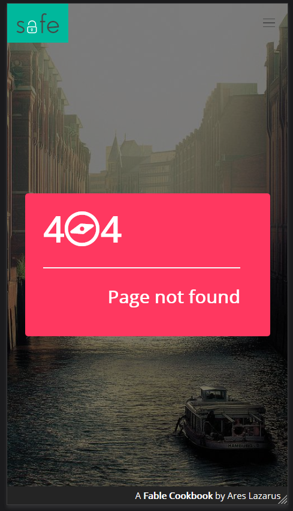

# Template.Extended.SAFE

  

A sample project created with the [SAFE Template](https://github.com/SAFE-Stack/SAFE-template) (with Fulma) extended to include SPA navigation, a responsive navbar, footer with status messages, a page loader functionality and even error boundaries.

It's meant to provide a useful point of reference for certain ubiquitous UX functionality that is not available out of the box in the template, while hopefully making someone's life easier by keeping all such samples in one place.

## Updated Fable references
This project uses the default SAFE.Template 1.0 output with the Fulma option as its basis, and is updated enought to be roughly equivalent with current (28/5/19) 1.6 SAFE.Template with the _--layout fulma-landing_ switch, meaning it allows for all the Core 3/React 5 bells and whistles.

I did however keep the dependency versions open-ended, meaning that building the project after a dependency update might break it. Which is fine, since experimenting with new features and integrating breaking changes is part of the reason I made this in the first place.

## Navigation
The samples leverage [elmish-browser](https://elmish.github.io/browser/navigation.html) in order to make the content of the browser's url bar available as input to your application. This means that you can use different url routes to access the various parts of your SPA application, while also updating browser history and thus enabling use of the browser back and forward buttons for navigation. Also implemented a graceful fallback message for bad urls.

Hashbang navigation is also supported, i.e. http://localhost:8080/page#subsection type urls.

TO DO: Guide to adding a new page

## Properly responsive navbar
Out of the box, the contents of the Bulma navigation bar simply disappeared on narrower viewports. I added the hamburger button and updated the MVU to allow for the expected responsive functionality.

## Footer
A slim footer at the bottom of the root page that also works as a host for status notifications. Back in the old days of SAFE.Template <= 1.0 we had to go looking how to implement Fulma  footers, this is a relic of those days (was that like three months ago?)

Status notification available via global messages.

**TO DO**: See if the notification functionality works better with [Thoth Toasts](https://mangelmaxime.github.io/Thoth/elmish/toast_docs.html)

## Page loader functionality
The Fulma page loader needed some not immediately obvious steps (well to me anyway...) to get it to work, such as updating the .scss file, available here for your convenience.

The activity indicator is here implemented as a globally available message, i.e. that can be called from any sub section of the SPA when it wants to block the interface and signal busy-ness by dispatching a _ToggleBusy of bool_ message.

## Sub page friendly structure
A file tree geared towards an SPA sectioned along pages that appear as the content of a root page that itself implements any navigation, activity indicator, status messaging and other globally available functionality.

The MVU pattern of each page is separated in Type/State/View files with an optional Data.fs, a pattern I saw in https://github.com/MangelMaxime/fulma-demo and which I am finding increasingly convenient, in both Fable and Fabulous. I also have this repo to thank for showing proper use of the bulma page loader in fulma.

## Error boundaries
The classic MVU Counter sample is here rigged to explode if the counter reaches 45, leading to a live example of how to use [React Error Boundaries](https://github.com/fable-compiler/fable-react/blob/master/docs/react-error-boundaries.md) in a Fable application.

If you want to see error boundaries in action with a real bug, just press the back button after loading a twitter time line in the data page.

## Caveat emptor
I have definitely not tested this template for production readiness, and very definitely not in a cloud or a container. Which is to say that while the fable-elmish code patterns should be good to go anywhere, I have so far not investigated what breaks and what works in the various deployment scenarios that the official template provides for, as far as referencial sturdiness and webpack packaging goes.

As far as I can tell, all F# code should be completely OK to use on SAFE.Template 1.6

Also, even though the template supports the newer react features, I have absolutely not done any work towards actually using them for optimization.

Finally, you won't find anything here with regards to data access or dapper usage.

